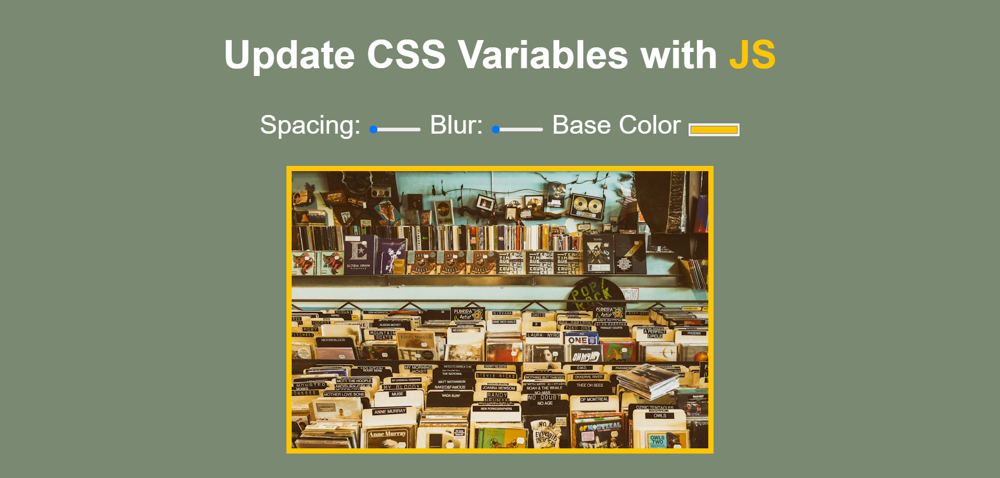

# CSS Variable Practice

## Overview

This project was created to **practice changing CSS with JavaScript**. It allows for real-time updates to CSS variables using HTML input elements. Through this, I can see how JavaScript can dynamically control CSS properties while immediately visualizing the results!

## Features

- **Dynamic CSS Changes**: Users can adjust the padding (spacing), blur effect, and base color of an image through input elements, and see the changes applied instantly.
- **CSS Variables**: The project leverages CSS custom properties (variables) to manage these styles.
- **JavaScript Interaction**: JavaScript is used to update the CSS variables based on user input.

## Why I Built This

I built this to practice interacting with CSS via JavaScript. By using inputs to modify CSS variables, I wanted to explore how JavaScript can manipulate styles in real-time and gain hands-on experience with dynamic UI manipulation through a basic application.

## How It Works

1. **HTML Structure**:

   - **Spacing**: Controls the padding around the image.
   - **Blur**: Adjusts the blur filter applied to the image.
   - **Base Color**: Changes the background color of the image and the color of specific text.

2. **CSS**:

   - I used **CSS variables** to store values for:
     - `--base`: The background color.
     - `--spacing`: The padding around the image.
     - `--blur`: The blur filter applied to the image.
   - These variables are defined in the `:root` selector, allowing them to be easily accessed and updated throughout the document.
   - CSS applies these variables to both the image and the `.js` class, so the text and image update in unison when the variables change.

3. **JavaScript**:
   - JavaScript listens for changes on the input elements (sliders and color picker).
   - The `handleUpdate()` function:
     - Retrieves the value from each input and its associated sizing unit (e.g., `px` for spacing and blur).
     - Updates the corresponding CSS variable using `document.documentElement.style.setProperty()`.
   - This process ensures that the image and text styles are updated in real time based on user interaction.

## Technologies Used

- **HTML5**: Basic page structure with form inputs and an image.
- **CSS3**: Custom properties (variables) for dynamic styling.
- **JavaScript**: Interacts with the input elements and updates the CSS in real time.

## Future Enhancements

- Add more controls for other CSS properties (e.g., border-radius, brightness).
- Explore more advanced JavaScript techniques to further improve interactivity.

## License

This project is open-source and free to use.
